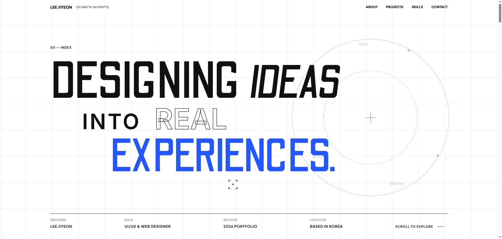

# LEE JIYEON PORTFOLIO

> 아이디어를 실제로 작동하는 경험으로 구현하는 UI/UX & Web Designer 이지연의 포트폴리오입니다.

[Live Site](https://sjian110-art.github.io/portfolio/) · [GitHub](https://github.com/sjian110-art)



## 1. About This Portfolio

**DESIGNING IDEAS INTO REAL EXPERIENCES**

이 포트폴리오는 사용자 문제를 발견하고 경험을 설계한 뒤, 실제 작동하는 화면으로 구현해 내는 저의 작업 방식을 담고 있습니다. 기획, UI/UX 디자인, 프론트엔드 웹 구현과 인터랙션 역량을 하나의 원페이지 사이트 안에서 유기적으로 보여줍니다.

메인 화면의 그리드 시스템과 회전하는 궤도 애니메이션을 통해 아이디어가 끊임없이 움직이고 발전하는 과정을 표현했습니다. 또한 AI 생성 결과를 단순히 수용하는 것에 그치지 않고, 명확한 기획과 디자인 방향을 설정한 후 실제 구현과 반복 검증을 위한 도구로 활용하는 저만의 방법론을 담았습니다.

## 2. Site Sections

### Hero
* 그리드 기반의 정교한 화면 레이아웃
* 무한히 회전하는 궤도 그래픽으로 역동성 부여
* 핵심 메시지 타이포그래피: `DESIGNING IDEAS INTO REAL EXPERIENCES`

### About
* 사용자의 핵심 문제 발견 및 경험 설계
* 구체적인 실제 화면 구현
* `DISCOVER · DESIGN · BUILD`의 체계적인 3단계 프로세스 소개

### Selected Works
* **말랑말랑 자취비서**: 1인 가구를 위한 생활비 관리 앱
* **Diptyque E-commerce & Editorial**: 향 탐색과 구매 경험을 잇는 커머스 웹
* **한국원자력연구원 웹사이트 리뉴얼**: 스토리텔링 기반의 전시형 웹사이트

### Project-to-Skills Transition
* 스크롤에 따라 작은 프레임이 전체 화면으로 부드럽게 확장되는 전환 인터랙션
* 구체적인 프로젝트 결과에서 전반적인 역량 소개로 자연스럽게 시선을 유도

### Skills & Tools
* Planning, Design, Development, AI Tools 4가지 영역으로 구분
* 실제 프로젝트 수행 경험을 바탕으로 한 퍼센티지 형태의 자기평가 제공

### Explore More
* Notion, GitHub, Notefolio로 연결되는 3개의 외부 채널 카드
* 카드 전체 영역이 클릭 가능하며, 모든 링크는 새 탭으로 열림

### Contact
* 클릭 한 번으로 이메일을 복사할 수 있는 Clipboard API 기능
* 사용자에게 명확한 피드백을 주는 복사 완료 토스트 알림
* 이메일 행 전체에 부드러운 연노랑 배경이 빠르게 두 번 점멸하는 클릭 유도 애니메이션 적용

## 3. Selected Projects

### 01. Mallang Life Assistant
1인 가구의 예산, 지출 기록, 비상금 챌린지와 통계를 하나의 흐름으로 연결한 생활비 관리 서비스입니다.
* [Live App](https://secretary-sigma-rust.vercel.app/splash)
* [Project Plan](https://app.notion.com/p/Project-1-73be67e45338833cb96d01270273eeb6)

### 02. Diptyque E-commerce & Editorial
사용자의 기억과 분위기를 바탕으로 향을 탐색하고 상품 확인부터 장바구니와 결제까지 경험할 수 있도록 구성한 이커머스 및 에디토리얼 프로젝트입니다.
* [Editorial Landing](https://diptyque-editorial-landing.vercel.app/)
* [E-commerce](https://diptyque-shop.vercel.app/)
* [Project Plan](https://app.notion.com/p/Project-2-84de67e4533883e1916a81afcb1c0749)

### 03. KAERI Website Renewal
한국원자력연구원의 연구 성과를 의료, 우주와 에너지 이야기로 연결해 보여주는 스크롤 기반 전시형 웹사이트 리뉴얼 프로젝트입니다.
* [Live Site](https://sjian110-art.github.io/renewal-structure-fixed/)
* [Project Plan](https://app.notion.com/p/Project-3-dcae67e4533883c6bac5810f7a7a5665)

## 4. Explore More Links

| Channel | Link |
| :--- | :--- |
| **Notion** | [https://app.notion.com/p/c60e67e45338825fb8b1019a2226c869](https://app.notion.com/p/c60e67e45338825fb8b1019a2226c869) |
| **GitHub** | [https://github.com/sjian110-art](https://github.com/sjian110-art) |
| **Notefolio** | [https://notefolio.net/sjan1102197](https://notefolio.net/sjan1102197) |

## 5. Key Features

실제 코드로 구현된 주요 기능과 인터랙션입니다.

* 스크롤 기반 섹션 전환과 등장 애니메이션
* 페이지의 배경과 프로젝트 테마에 따라 색상이 변화하는 커스텀 커서
* 프로젝트별 이미지 호버 및 프레임 선택
* 선택한 썸네일과 메인 이미지 교체 (Diptyque · KAERI 프로젝트)
* 자취비서 화면 팝업 인터랙션
* 전환 프레임 스크롤 확장 인터랙션
* 외부 채널 카드 호버 효과
* 이메일 Clipboard API 복사
* 복사 완료 토스트 알림
* CSS Grid 및 `clamp()` 함수를 활용한 모바일/태블릿/데스크톱 반응형 레이아웃

## 6. Tech Stack

| Category | Technologies |
| :--- | :--- |
| **Planning** | Notion |
| **Design** | Figma |
| **Frontend** | HTML5, CSS3, Vanilla JavaScript (ES6+) |
| **Animation / Interaction** | CSS Transitions/Keyframes, Intersection Observer API |
| **APIs** | Clipboard API |
| **AI-assisted Workflow** | ChatGPT, Claude, Gemini, AntiGravity |
| **Deployment** | GitHub Pages |

> **Note**: 별도의 프레임워크(React, Vue)나 외부 애니메이션 라이브러리(GSAP) 없이 Vanilla 환경에서 직접 렌더링 성능과 모션을 제어하며 구현했습니다.

## 7. Project Structure

```text
portfolio/
├── index.html
├── css/
│   └── style.css
├── js/
│   └── script.js
└── assets/
    ├── images/         # 글로벌 공통 에셋 및 프리뷰
    ├── jachwi/         # 자취비서 프로젝트 이미지
    ├── diptyque/       # 딥티크 프로젝트 이미지
    └── kaeri/          # 한국원자력연구원 프로젝트 이미지
```

## 8. Local Setup

이 프로젝트는 정적 웹사이트이므로 패키지 관리자를 통한 별도의 패키지 설치나 빌드 과정이 필요하지 않습니다.

```bash
git clone https://github.com/sjian110-art/portfolio.git
cd portfolio
```

브라우저에서 `index.html`을 직접 실행하는 것보다 원활한 API 지원을 위해 VS Code의 **Live Server** 등의 로컬 서버 익스텐션 사용을 권장합니다.

## 9. Contact

* **Name**: 이지연 · LEE JIYEON
* **Email**: [lars00@naver.com](mailto:lars00@naver.com)
* **GitHub**: [https://github.com/sjian110-art](https://github.com/sjian110-art)
* **Notefolio**: [https://notefolio.net/sjan1102197](https://notefolio.net/sjan1102197)

---

Designed & Developed by LEE JIYEON  
© 2026 LEE JIYEON. All rights reserved.
